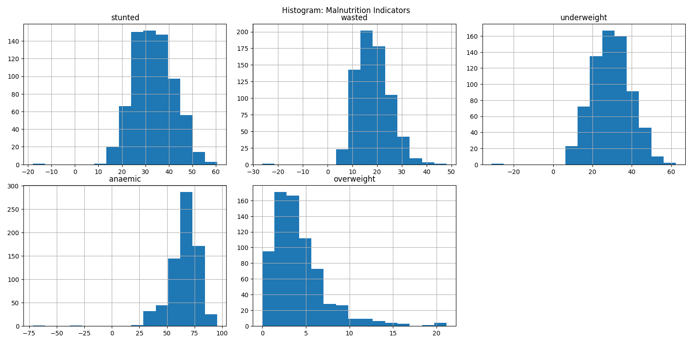
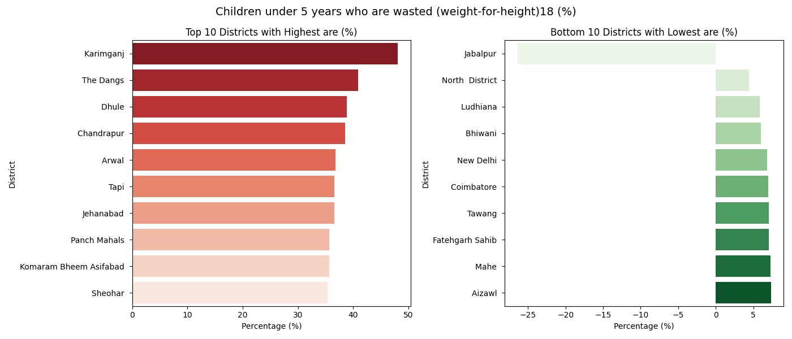

# EDA Project: Analysis of Child Nutrition in India

This project performs **Exploratory Data Analysis (EDA)** on child nutrition data using Python libraries like Pandas, Matplotlib, and Seaborn.

**Author**: Satyam Yadav

---

### Correlation Heatmap  

### Malnutrition Types Distribution  

### Regional Child Nutrition Status  

### Top and Bottom Performing Districts

- **Stunted**
  

- **Wasted**
  

- **Underweight**
  

- **Overweight**
  

- **Anaemic**
  

